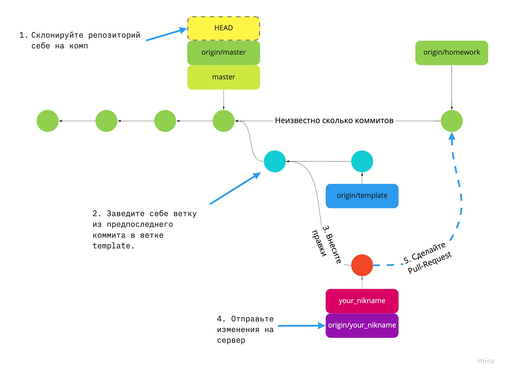
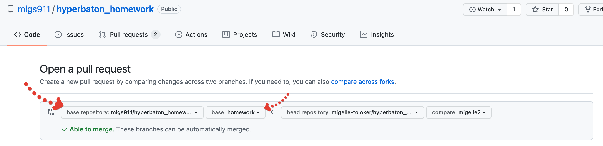
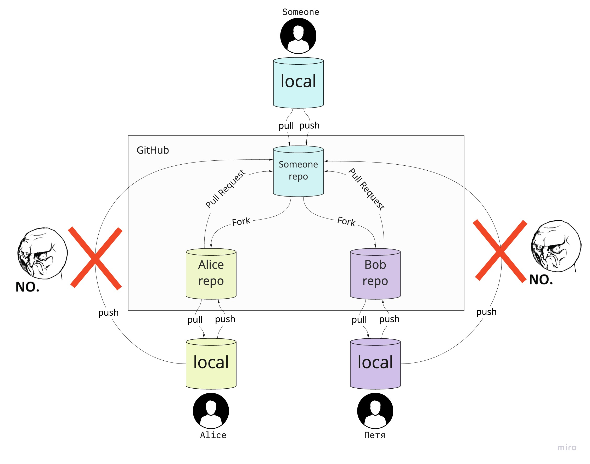

# Ваше задание

## Перед началом

1. Зарегистрируйтесь на GitHub, если вы ещё не.
2. Прочтите инструкцию и взгляните на картинку, чтобы точно всё понять. Если будут вопросы — задавайте в тикетах или в чате.

В инструкции намеренно нет конкретных команд, которые вам надо будет выполнить, или скриншотов с кнопками в интерфейсе. Это сделано для того, чтобы вы научились гуглить и решать проблемы самостоятельно.

Ещё пара советов перед началом:
1. Вам необязательно лезть в командную строку, чтобы выполнить это задание можно выполнить. Но учтите, что когда будете гуглить, то в ответах обычно будут решения именно для командной строки. Но это не бесполезная информация для вас: вы можете попытаться повторить эти действия в интерфейсе, т.к. там обычно используются такие же названия для всех основных действий (checkout, commit, push, log, reset и т.п.).

   Учтите, не всё можно сделать в интерфейсе. Например, в GitHub Desktop нельзя сделать reset.

   А если через интерфейс не получается, то можно попробовать скопировать команду и вставить в терминал. Но советую перед этим  почитать про эту команду. Это можно сделать в [документации](https://git-scm.com/docs), либо можете добавить в конце команды **через пробел** `-h` для краткой справки или `--help` для более подробной.
2. Если у вас Windows, то при установке командной строки выбирайте git bash. Не выбирайте CMD в качестве командной строки, намучаетесь с ним.

## Инструкция

Коротко:

1. Сделайте Fork этого репозитория — создайте свою личную копию этого репозитория на гитхабе. Не знаешь, что такое форки и как устроен GitHub? См. объясняющую картинку.
2. Склонируйте созданный форк к себе на компьютер.
3. В репозитории есть ветка `template`, но последний коммит в ней бесполезен — всю информацию по ошибке удалили. Вам нужен предыдущий коммит.

   Вам надо:
   1. Выяснить SHA этого коммита. SHA — это хеш коммита, т.е. его идентификатор.
   2. Завести свою ветку так, чтобы в ней была та же версия файлов, что и в этом коммите. В качестве имени ветки укажите свой логин на github.

   **Застряли?** Переключитесь на ветку `template`, там есть файл с парой подсказок.
4. После этого у вас появится папка `homework` с файлом `template.txt`.
   На первой строчке в нём будет написано `<commit_sha>` и текст Lorem Ipsum.

   Вам надо:
   1. Переименуйте файл заменив имя файла `template.txt` на ваш логин, вот так: `<login>.txt`.
   2. В самом файле заменить `<commit_sha>` на хеш, коммита, который вы выяснили ранее.
   3. Удалите файл с подсказками в корне репозитория. Он ведь должен остаться только вветке `template`.
   4. Внесённые изменения не забывайте сохранять — т.е. коммитить.
      **Совет**: переименования и переносы файлов всегда делайте отдельным коммитом. Почему? Небольшой ликбез в конце файла.
5. Отправьте свои изменения на сервере, т.е. сделайте push.
6. Вернитесь на страницу своего форка на GitHub и откройте пулл-реквест из своей ветки в исходный репозиторий в ветку `homework`. Как на картинке.

   

## Как работают форки

В GitHub нельзя просто так любому отправлять изменения в чужие репозитории. Но можно создать форк — свою копию репозитория, делать все изменения в своей копии, а потом попросить владельца исходного репозитория принять эти изменения — сделать пулл-реквест из своего репозитория в его.

## Перенос файлов делайте отдельным коммитом

Представьте, что у вас 2 ветки, в которых менялся один и тот же файл. Но в одной из веток этот файл дополнительно переименовали.

Знайте:
1. Git не отслеживает переименования, пока вы не сделаете git add или git commit.
1. Git не понимает, что вы переименовали файл, если помимо переименования в нём ещё **много** правок. Он подумает, что вы старый файл удалили, а новый добавили.

Это значит, что при объединении веток может произойти такое:
* в лучшем случае Git выдаст конфликт, чтобы вы перепроверили изменения вручную.
* в худшем случае Git просто повторит ваши изменения: т.е. удалит версию файла из одной ветки, а добавит версию из другой ветки.

Возможно, что всё будет ок. Когда я тестил, то 2 раза получил разный результат, один раз git понял что было переименование, другой — не понял. Зависит это от многих вещей, в т.ч. от количества изменений, внесённых вместе с переименованием.

А если сделать переименование отдельным коммитом, то гит будет знать, что это один и тот же файл. И при объединении веток git поймёт что в обоих ветках изменения были в одном и том же файле, а значит сохранит и сами изменения и переименование файла. Ну или хотя бы выдаст конфликт, но точно не потеряет ваши данные.

P.S. конкретно в нашем задании ничего не сломается, т.к. изменений